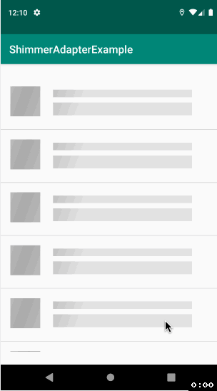

# ShimmerAdapter
[](https://jitpack.io/#omid-io/ShimmerAdapter)

## Getting start with ShimmerAdapter

#### Step 1. Add the JitPack repository to your build file

Add it in your root build.gradle at the end of repositories:

```groovy
  allprojects {
     repositories {
       ....
       maven { url 'https://jitpack.io' }
     }  
  }
```
  
#### Step 2. Add the dependency
```groovy
  dependencies {
      implementation 'com.github.omid-io:ShimmerAdapter:<version>
  }
```
  
List of versions available can be found at https://jitpack.io/#omid-io/ShimmerAdapter.

#### Step 3. Extend the ShimmerAdapter class and set it on your RecyclerView
```java
        ShimmerAdapter myShimmerAdapter = new ShimmerAdapter(true) {

            @Override
            public void onBindViewHolderCallback(@NonNull RecyclerView.ViewHolder holder, int position) {
                // your own logic here
            }

            @Override
            public int getViewType(int position) {
                return VIEW_TYPE_DATA;
            }

            @Override
            public RecyclerView.ViewHolder getViewHolder(@NonNull ViewGroup parent, int viewType) {
                return new MyActualDataViewHolder(...);
            }

            @Override
            public int getShimmerLayoutId() {
                return R.layout.shimmer_layout;
            }

            @Override
            public int getDataCount() {
                return data.size();
            }

            @Override
            public int getShimmerItemsCount() {
                return 5;
            }
        };
```

There are several other methods/options you can call on the ShimmerAdapter, below is a couple examples. 

```
useShimmerConfig(@Nullable Shimmer shimmer) 
- pass in a Shimmer configuration or null to use the default. Calling this method will use the ShimmerFrameLayout

useCustomShimmerAnimation(Animation animation)
- pass in a custom animation to be used when the adapter is in "shimmer" mode
```

## Demo

 


## License

This repository is released under the following licenses:

ShimmerAdapter [MIT License](https://github.com/omid-io/ShimmerAdapter/blob/master/LICENSE)

Facebook shimmer-android (ShimmerFrameLayout) [BSD License](https://github.com/facebook/shimmer-android/blob/master/LICENSE)

