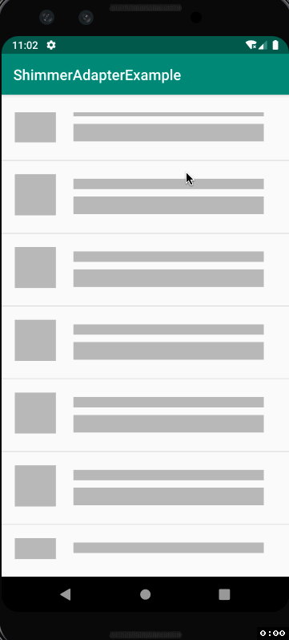

# ShimmerAdapter
[](https://jitpack.io/#omid-io/ShimmerAdapter)

## Getting start with ShimmerAdapter

##### Step 1. Add the JitPack repository to your build file

Add it in your root build.gradle at the end of repositories:

```groovy
  allprojects {
     repositories {
       ....
       maven { url 'https://jitpack.io' }
     }  
  }
```
  
##### Step 2. Add the dependency
```groovy
  dependencies {
      implementation 'com.github.omid-io:ShimmerAdapter:1.1
  }
```
  
List of versions available can be found at https://jitpack.io/#omid-io/ShimmerAdapter.

##### Step 3. Extend the ShimmerAdapter class and set it on your RecyclerView
```java
        ShimmerAdapter myShimmerAdapter = new ShimmerAdapter(true) {

            @Override
            public void onBindViewHolderCallback(@NonNull RecyclerView.ViewHolder holder, int position) {
                // your own logic here
            }

            @Override
            public int getViewType(int position) {
                return VIEW_TYPE_DATA;
            }

            @Override
            public RecyclerView.ViewHolder getViewHolder(@NonNull ViewGroup parent, int viewType) {
                return new MyActualDataViewHolder(...);
            }

            @Override
            public int getShimmerLayoutId() {
                return R.layout.shimmer_layout;
            }

            @Override
            public int getDataCount() {
                return data.size();
            }

            @Override
            public int getShimmerItemsCount() {
                return 5;
            }
        };
```

You can pass a boolean through the constructor to indicate if the initial state of the adapter should be to show shimmer items. There are some other methods you can override, e.g. to provide your own shimmer animation if you don't want to use the default one.



